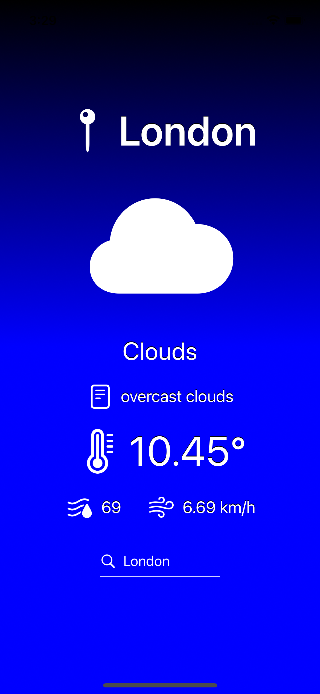
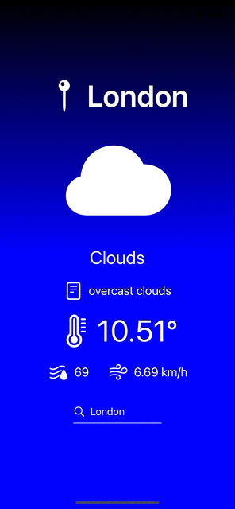
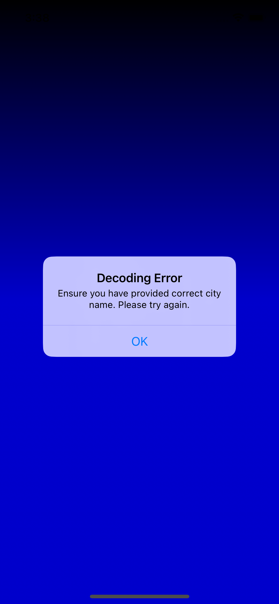
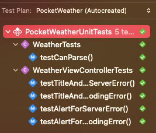

# PocketWeather
The PocketWeather App allows user to check weather in desired city. After typing city name and hitting return call to API is made. When the city 
name is correct user receives desired data such as a: temperature, humidity, wind speed, if it's sunny, cloudy, rainy etc. If there was problem with API 
call such as a providing wrong city user is alarmed by notification. Keyboard is repositioned to center text field in the midle after clicking in it.
Unit tests were provided to check mocked API call and error occurencies.
 
 
 
To make the app work on your device you need to generate an API key and insert it into Keys.plist.
 

### Used Technologies:
1. UIKit
2. Fetching JSON data from API - https://openweathermap.org
3. SFSymbols
4. Unit tests
5. Notifications
 

### Screenshots

#### Home screen

#### Weather screen

#### Keyboard reposition and fetching weather

#### Notification

#### Testing results

